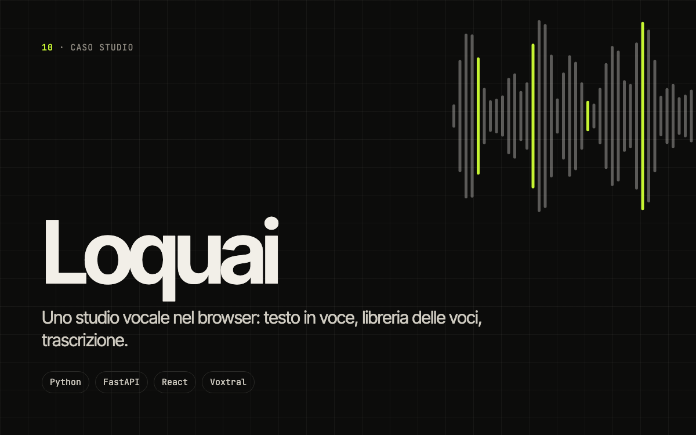

# Loquai

> Uno studio vocale nel browser: trasforma un testo in voce, gestisce una libreria di voci e trascrive l’audio.

`10` · **Progetto personale · voce** · 2026 · Ideazione e sviluppo

[Caso studio completo](https://portfolio.lele-tradevalue.com/progetti/loquai/) · [English version](https://portfolio.lele-tradevalue.com/en/progetti/loquai/)

## Il problema

Chi produce contenuti audio passa da uno strumento all’altro: uno per la sintesi, uno per le voci, uno per le trascrizioni, ognuno con il suo account e i suoi limiti.

## Cosa ho costruito

Loquai riunisce tutto in uno studio web: editor di testo con generazione vocale, libreria delle voci, trascrizione e cronologia dei lavori, con una struttura pronta per più utenti e quote.

## Come funziona

1. **Scrivi** — Il testo da far leggere.
2. **Scegli la voce** — Dalla libreria personale.
3. **Genera e ascolta** — Il file resta nello storico.
4. **Trascrivi** — Il percorso inverso, dall’audio al testo.

## Perché funziona

- **Un solo posto.** Sintesi, voci e trascrizione insieme.
- **Pronto per più utenti.** Account, quote e cronologia separati.

## Stack

`Python` `FastAPI` `React` `SQLite` `Mistral Voxtral`

## Cosa resta privato

Panoramica selettiva: codice e configurazioni restano privati. Questo repository contiene solo la presentazione del progetto: niente codice sorgente, cronologia o configurazioni.

<b>In English</b>

**Loquai** — A voice studio in the browser: turn text into speech, manage a library of voices and transcribe audio.

Loquai brings it all into one web studio: a text editor with voice generation, a voice library, transcription and job history, structured to support multiple users and quotas.

- **One place.** Synthesis, voices and transcription together.
- **Multi-user ready.** Separate accounts, quotas and history.

[Read the full case study and try the demo →](https://portfolio.lele-tradevalue.com/en/progetti/loquai/)

---

Emanuele Montalto · [portfolio](https://portfolio.lele-tradevalue.com) · [LinkedIn](https://www.linkedin.com/in/emanuele-montalto/) · [montalto36@gmail.com](mailto:montalto36@gmail.com)
